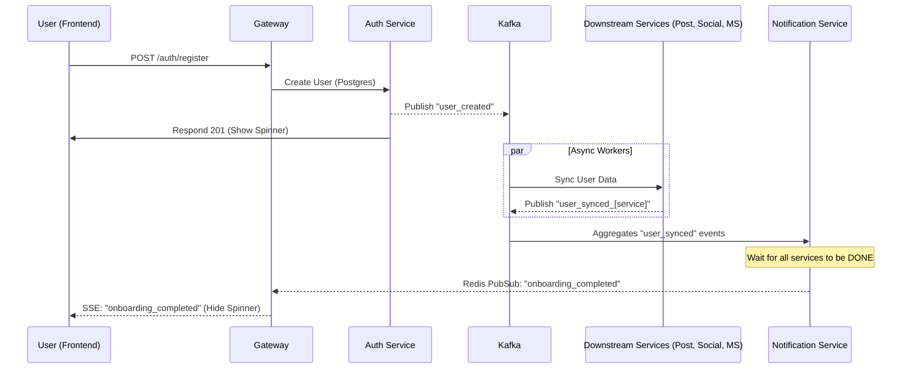

# Project TODOs & Architecture

## Registration & Onboarding Workflow
The project uses a Distributed Saga (Choreography-based) and an Aggregator pattern for completion signaling.

## Microservice Design Principles (FAQ)
### Is data duplication (e.g. users in Messaging Service) an error?
**No, it is a requirement.** 
- **Decoupling**: If `messaging-service` depended on `auth-service` for every name display, a failure in Auth would break Messaging.
- **Database per Service**: Each service owns its data projection. `messaging-service` doesn't "register" users; it maintains a **Read Model** of users optimized for chat.

## Security & Hardening
- [x] **SSE Authentication**: JWT validation implemented. User ID extracted from token claims. [DONE]

## Future Tasks
- [ ] **Onboarding Completion Signal**: 
    - [ ] Update `post`, `social`, and `messaging` to emit `user_synced` events.
    - [ ] Implement aggregation logic in `notification-service` using Redis to track sync progress.
    - [ ] Send final SSE event when all syncs are done.
- [ ] **Historical Presence Storage**: Implement persistent storage for user presence transitions in Cassandra.
- [ ] **Analytics Service**: Develop a dedicated service for Business Intelligence (BI) metrics.

## Observability
- [/] **Standardize Middleware**: Ensure all microservices use `observability.MiddlewareMetrics`.
