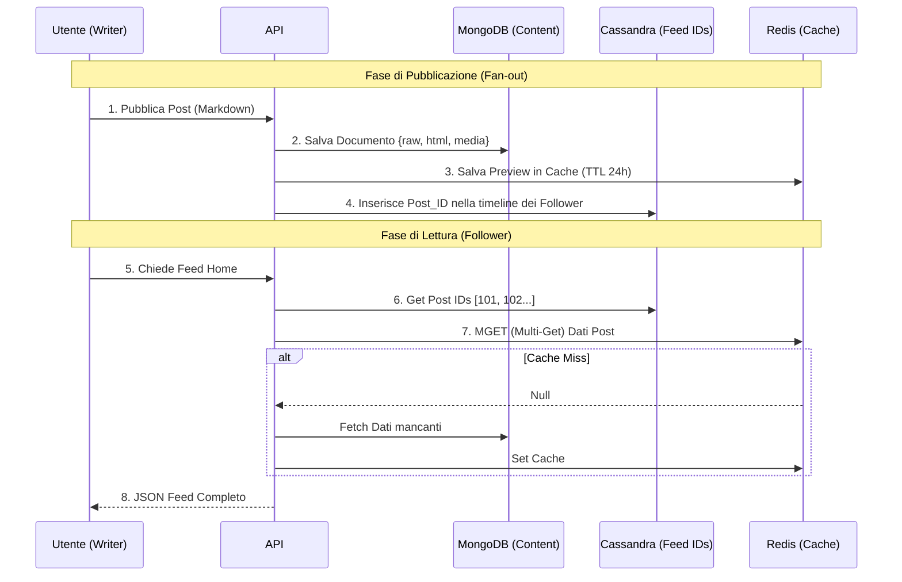
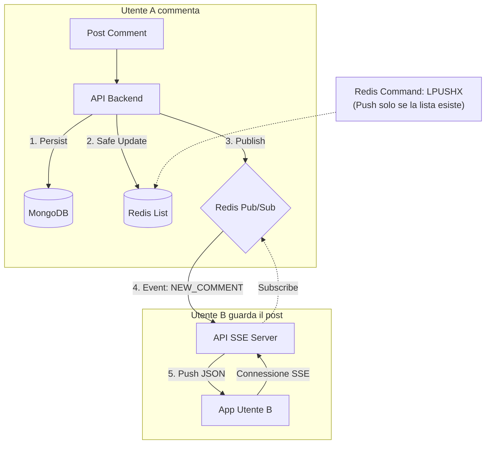
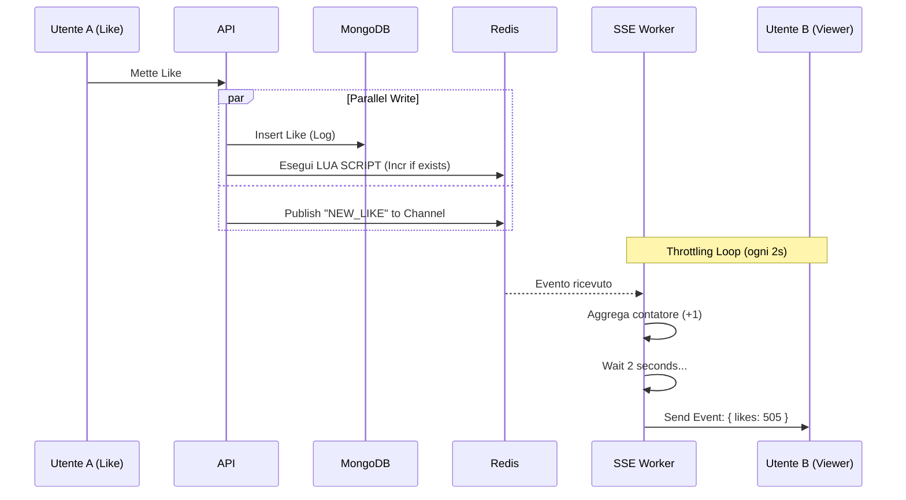

# Roadmap & TODOs

## ⚡ Attività Prioritarie

- [ ] **Historical Presence Storage**: Implement persistent storage for user presence transitions in Cassandra.
- [ ] **Analytics Service**: Develop a dedicated service for Business Intelligence (BI) metrics.
- [ ] **Search Service (MeiliSearch)**:
    - [ ] Create a new service for indexing users and content.
    - [ ] Implement event listeners to sync data from Kafka to MeiliSearch.
- [ ] **Email Service**:
    - [ ] Implement a service for sending transactional emails (Welcome, Password Reset, 2FA).
    - [ ] Integrate with `auth-service` for 2FA and password recovery flows.
- [ ] **Testing Automatico**:
    - [ ] Implementare test di integrazione usando **Testcontainers** (supporto per Kafka, Redis, Mongo, Cassandra).
    - [ ] Creare scenari di load testing con **k6** per validare la concorrenza e i limiti del sistema.

---

# 🏛 Specifica Architettura "Hybrid Live"

Questa architettura bilancia **persistenza solida** (non perdi dati), **alte prestazioni** (cache aggressiva) e **real-time** (SSE), evitando i bug classici come il "Thundering Herd" o il "Reset dei contatori".

## 🏗️ Lo Stack Tecnologico

* **Database (Source of Truth):** MongoDB (Post, Commenti, Metadati).
* **Timeline Store:** Cassandra (Solo ID ordinati per il feed).
* **Cache & Pub/Sub:** Redis.
* **Object Storage:** S3 + CDN (Media).
* **Real-Time:** Server-Sent Events (SSE).

---

## 1. Gestione del Feed (La Timeline)

**Obiettivo:** Caricamento istantaneo della Home.
**Tecnica:** Fan-out on Write (Pre-calcolo).

* **Scrittura (Post):** Quando pubblichi, l'ID del post viene copiato nelle liste di tutti i tuoi follower su Cassandra.
* **Lettura (Home):** Si leggono gli ID da Cassandra e si "idratano" i dati (Titolo, Preview) prendendoli da Redis (o Mongo in fallback).



---

## 2. Gestione "Live" dei Commenti

**Obiettivo:** Mostrare i nuovi commenti in tempo reale senza invalidare la cache.
**Tecnica:** Write-Through con `LPUSHX` + SSE.

* **Logica:** Se la cache esiste, aggiungi il commento in cima. Se non esiste, non fare nulla (si rigenererà alla prossima lettura).
* **TTL:** Alto (2-4 ore), perché la lista viene mantenuta aggiornata attivamente.



---

## 3. Gestione "Live" dei Mi Piace (Contatori)

**Obiettivo:** Aggiornare il numero velocemente ma evitare scritture inutili e il bug del "reset a 1".
**Tecnica:** Lua Script (`INCR_IF_EXISTS`) + SSE Throttling.

* **Logica:** Incrementa su Redis solo se la chiave c'è. Se manca, non crearla (evita disallineamento).
* **Throttling:** Non mandare un evento SSE per ogni like. Accumula e manda ogni 2 secondi.



---

## 4. Riepilogo Strategia Caching & TTL

Ecco la tabella finale da usare come riferimento per la configurazione di Redis.

| Tipo Dato | Dove vive (Master) | Strategia Redis (Cache) | Comando Critico | TTL Consigliato |
| --- | --- | --- | --- | --- |
| **Post Body** | MongoDB | **Read-Through** (Leggo se manca) | `GET` / `SET` | **24 Ore** (Slide on access) |
| **Feed (Home)** | Cassandra | **Non cachato** (Già veloce) | N/A | N/A |
| **Commenti** | MongoDB | **Write-Update** (Aggiorno se c'è) | `LPUSHX` | **4 Ore** (Rinnovo automatico) |
| **Likes (Count)** | MongoDB (Count) | **Write-Update** (Incr. se c'è) | `EVAL` (Lua Script) | **24 Ore** (Se usiamo Lua) |
| **Likes (Stream)** | N/A | **Pub/Sub** (Effimero) | `PUBLISH` | Nessuno (Real-time) |

### Snippet dello Script Lua (Per i Like)

Da usare nel backend Node.js/Python/Go al posto di `redis.incr()`:

```lua
-- Keys[1]: "post:123:likes"
if redis.call("EXISTS", KEYS[1]) == 1 then
    return redis.call("INCR", KEYS[1])
else
    return nil -- Segnala che la cache è fredda, non fare nulla.
end
```

### Perché questa è l'architettura vincente?

1. **DB Scarico:** MongoDB viene letto solo la prima volta (Cache Miss) o per paginazioni profonde. Tutto il traffico caldo è su Redis.
2. **Dati Coerenti:** Grazie a `LPUSHX` e Lua Script, non avrai mai liste commenti a metà o contatori like resettati a 1 per errore.
3. **Live Feeling:** L'utente percepisce l'app come "viva" grazie a SSE, ma sotto il cofano i dati sono solidi su disco.
