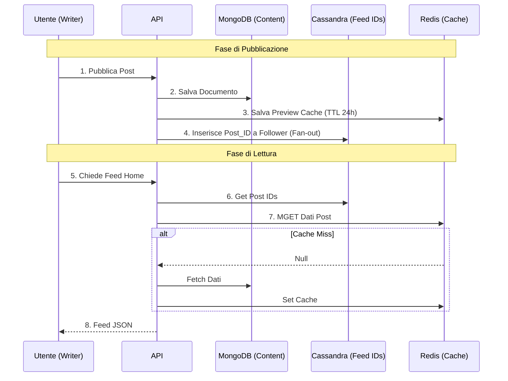
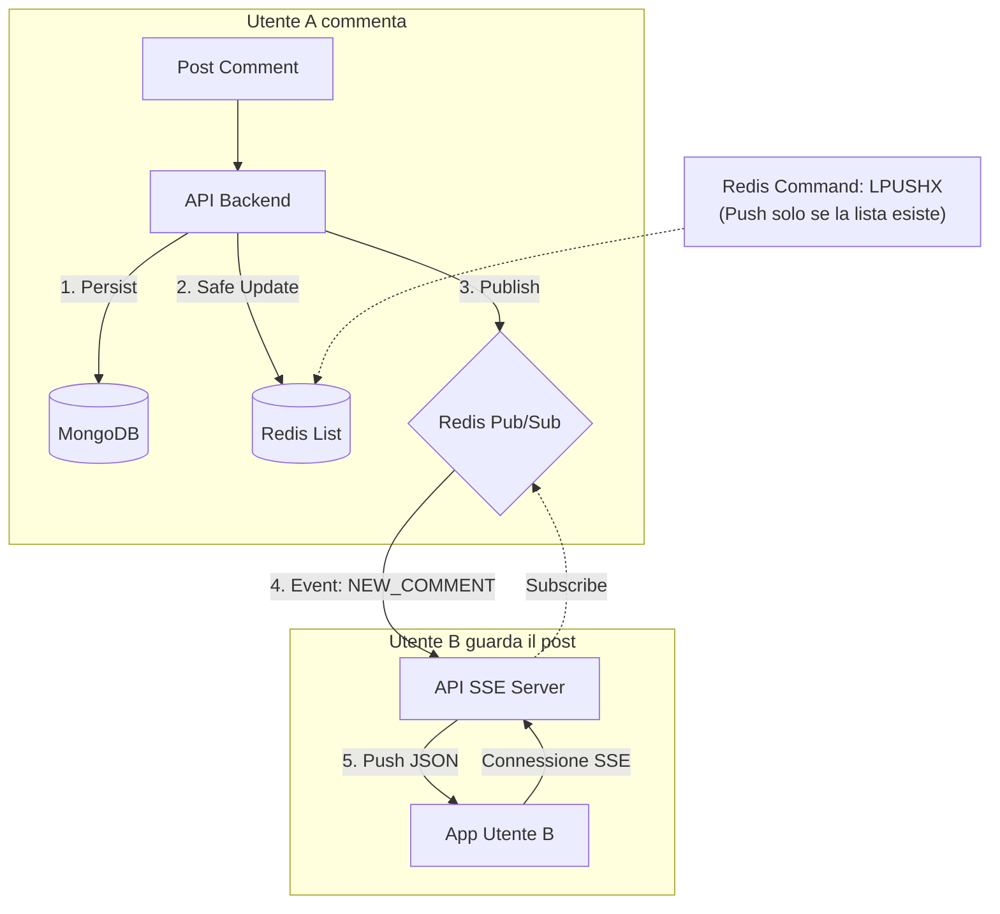
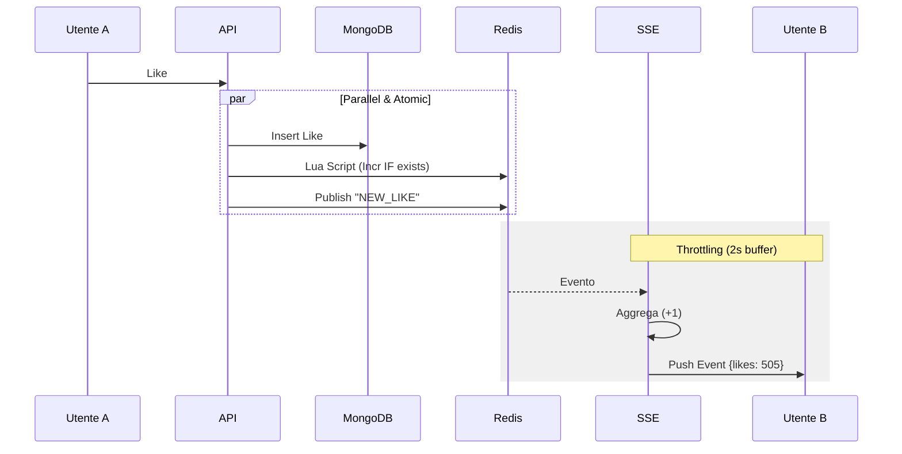
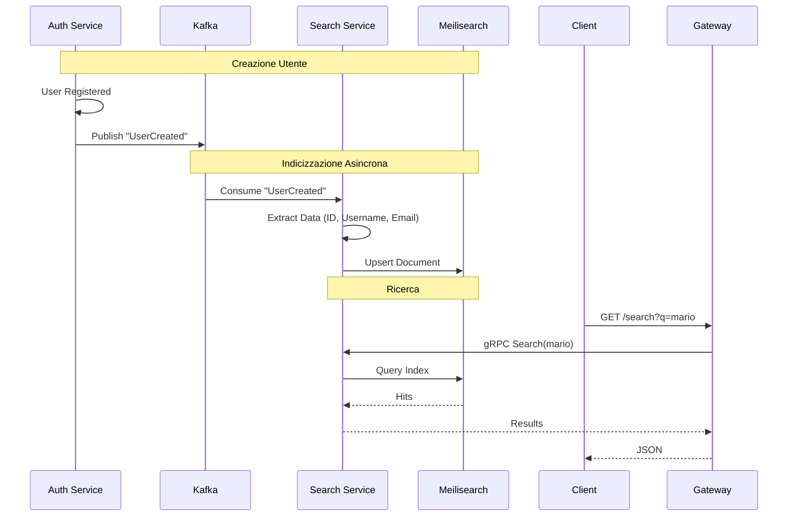

# 🏛 Architettura Vibely

## 🎯 Visione & Obiettivi

Vibely è una piattaforma a microservizi per community culturali.
**Obiettivo**: Creare un sistema scalabile, resiliente e manutenibile per gestire Identità, Contenuti e Interazioni Sociali.

> 📘 **Approfondimento Tecnico**: Per i dettagli sulle sfide superate (es. orchestrazione notifiche, fallback, migrazioni), vedi **[ARCHITECTURAL_CHALLENGES.md](architectural_challenges.md)**.

---

## 🗺️ Diagramma del Sistema

Ecco una rappresentazione visiva dell'intera architettura a microservizi:

```mermaid
flowchart TB
    subgraph Client_Layer ["Client Layer"]
        User(("User / App"))
    end

    subgraph Edge_Layer ["Edge Layer"]
        Gateway["Gateway Service<br/>(Huma/Go)"]
    end

    subgraph Service_Layer ["Microservices Layer"]
        Auth["Auth Service"]
        Post["Post Service"]
        Social["Social Service"]
        Messaging["Messaging Service"]
        Search["Search Service"]
        Notif["Notification Service"]
    end

    subgraph Data_Layer ["Data & State Layer"]
        PG[("Postgres<br/>(Auth DB)")]
        Mongo[("MongoDB<br/>(Post DB)")]
        Neo4j[("Neo4j<br/>(Social Graph)")]
        Cass[("Cassandra<br/>(Messages/Feed)")]
        Meili[("Meilisearch<br/>(Full Text)")]
        Redis[("Redis<br/>(Cache/PubSub)")]
        Kafka{"Kafka<br/>(Event Bus)"}
    end

    %% Client Interactions
    User <-->|HTTP/REST| Gateway
    User <-->|SSE (Events)| Gateway

    %% Gateway to Services (gRPC)
    Gateway <-->|gRPC| Auth
    Gateway <-->|gRPC| Post
    Gateway <-->|gRPC| Social
    Gateway <-->|gRPC| Messaging
    Gateway <-->|gRPC| Search

    %% Service to Data
    Auth <--> PG
    Auth <--> Redis
    Post <--> Mongo
    Social <--> Neo4j
    Messaging <--> Cass
    Search <--> Meili

    %% Event Driven (Writes)
    Auth -.->|"Pub: UserCreated"| Kafka
    Post -.->|"Pub: PostCreated"| Kafka
    Social -.->|"Pub: Followed"| Kafka
    Messaging -.->|"Pub: MessageSent"| Kafka

    %% Search Indexing (Async)
    Kafka == "Consumer Group" ==> Search

    %% Notification Flow (Reads)
    Kafka == "Consumer Group" ==> Notif
    Notif -- "Publish Targeted" --> Redis
    Redis -- "Sub (InstanceID)" --> Gateway
```

---

## 🏗 Stack Tecnologico (Hybrid Live)

Affinato per garantire persistenza, performance e real-time.

| Componente          | Tecnologia  | Ruolo                                                         |
| :------------------ | :---------- | :------------------------------------------------------------ |
| **Source of Truth** | MongoDB     | Document Store principale (Post, Commenti).                   |
| **Timeline Store**  | Cassandra   | Time-series ordinata solo per gli ID del feed (Fan-out).      |
| **Search Engine**   | Meilisearch | Ricerca Full-Text veloce e tollerante ai typo (Utenti).       |
| **Graph DB**        | Neo4j       | Relazioni sociali complesse (Follow/Follower recommendation). |
| **Cache & Pub/Sub** | Redis       | Caching preview, conteggi write-through e messaggistica SSE.  |
| **Real-Time**       | SSE + Huma  | Push "Live" verso il client (es. nuovi commenti/like).        |
| **Media**           | MinIO (S3)  | Object Storage per immagini/video.                            |

---

## 🧩 Struttura Interna (Standard Microservice Layout)

Tutti i microservizi (`backend/microservices/*`) seguono tassativamente questa struttura modulare per garantire manutenibilità e coerenza:

| Modulo                    | Contenuto e Responsabilità                                                                                                                           |
| :------------------------ | :--------------------------------------------------------------------------------------------------------------------------------------------------- |
| **`internal/app`**        | **Bootstrap & Orchestration**: Contiene `App` struct. Inizializza tutte le dipendenze (DB, Repos, Watermill) e gestisce il ciclo di vita (Run/Stop). |
| **`internal/api`**        | **Transport Layer**: Implementazione dei server (gRPC o HTTP/Huma). Qui risiede la logica di interfaccia, validazione input e mapping.               |
| **`internal/events`**     | **Event Driven**: Configurazione del `WatermillManager`. Gestisce Router, Publisher e Subscriber Kafka. Mappa i topic sui handler.                   |
| **`internal/handler`**    | **Business Logic Wrappers**: Gestori puri utilizzati da API o Eventi per coordinare i repository e regole di business.                               |
| **`internal/repository`** | **Data Access**: Implementazioni concrete per l'accesso ai DB (Postgres, Mongo, Neo4j, Redis, Cassandra, Meilisearch).                               |
| **`main.go`**             | **Entrypoint**: Minimalista. Carica la configurazione, inizializza l'osservabilità e delega tutto ad `app.New()` e `app.Run()`.                      |

---

## 🏎 Strategia Caching & Performance

Ecco la tabella di riferimento per la gestione dei dati in Redis:

| Tipo Dato          | Dove vive (Master) | Strategia Redis (Cache)            | Comando Critico | TTL        |
| ------------------ | ------------------ | ---------------------------------- | --------------- | ---------- |
| **Post Body**      | MongoDB            | **Read-Through** (Leggo se manca)  | `GET` / `SET`   | **24 Ore** |
| **Feed (Home)**    | Cassandra          | **Non cachato** (Già ottimizzato)  | N/A             | N/A        |
| **Commenti**       | MongoDB            | **Write-Update** (Aggiorno se c'è) | `LPUSHX`        | **4 Ore**  |
| **Likes (Count)**  | MongoDB            | **Write-Update** (Incr. se c'è)    | `EVAL` (Lua)    | **24 Ore** |
| **Ricerca Utente** | Meilisearch        | **Cache-Aside** (Opzionale)        | N/A             | **1 Ora**  |

---

## 🔄 Workflow Principali

### 1. Feed Timeline (Fan-out on Write)

Obiettivo: Caricamento istantaneo della Home. L'ID viene propagato ai follower in scrittura.



### 2. Live Comments (Write-Through)

Obiettivo: Aggiornare la lista commenti in cache e notificare via SSE senza race conditions.



### 3. Live Likes (Throttling)

Obiettivo: Contatore "vivo" ma solido. Lua script per l'atomicità, Throttling per non saturare il client.



### 4. Search Indexing (Event-Driven)

Obiettivo: Mantenere l'indice di ricerca disaccoppiato e consistente.


