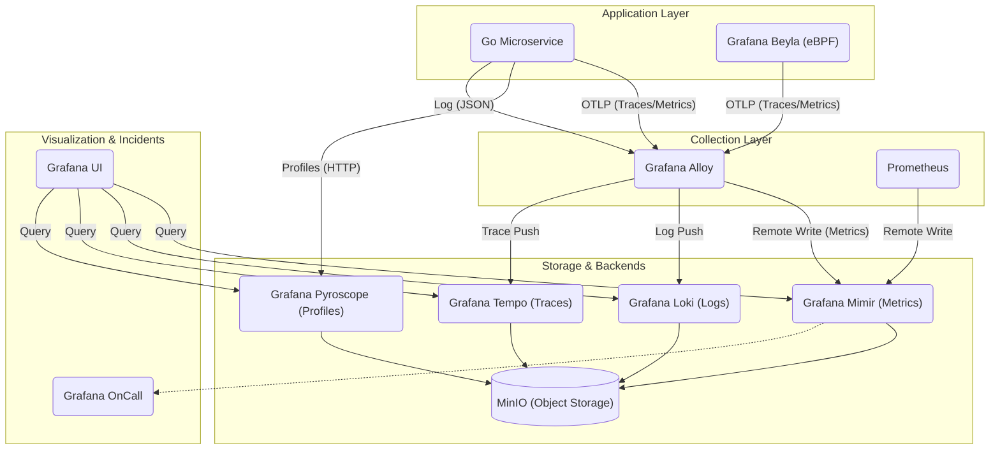

# Observability Stack (LGTM + Prometheus + OnCall)

This document describes the observability stack implemented for the project, based on the **LGTM** stack (Loki, Grafana, Tempo, Mimir) with **Prometheus** for scraping and **Grafana OnCall** for incident management.

## Components

### 1. Visualization & Alerting
- **Grafana**: The unified frontend for all observability data (Metrics, Logs, Traces, Profiles).
- **Grafana OnCall**: Incident response and management tool. Links alerts to on-call schedules.

### 2. Signals
- **Metrics**:
    - **Prometheus**: Scrapes targets (Microservices, Infrastructure) and stores short-term metrics.
    - **Mimir**: Long-term storage for metrics, capable of receiving remote writes from Prometheus or Alloy.
- **Logs**:
    - **Grafana Loki**: Log aggregation system. Optimized for logs with low cardinality labels.
- **Traces**:
    - **Grafana Tempo**: High-volume, high-cardinality distributed tracing backend.
- **Profiling**:
    - **Pyroscope**: Continuous profiling backend (CPU, Memory).

### 3. Collection & Instrumentation
- **Grafana Alloy**: The central collector/agent.
    - Receives OTLP (Traces, Metrics, Logs) from Applications and Beyla.
    - Scrapes Prometheus endpoints (if configured).
    - Exports data to Mimir, Loki, and Tempo.
- **Grafana Beyla**: eBPF-based auto-instrumentation tool.
    - Observes HTTP/HTTPS/GRPC traffic at the kernel level without code modification.
    - Sends Red Metrics and Traces to Alloy.
- **Application (Go)**:
    - Manual instrumentation using OpenTelemetry SDK (via `shared/pkg/observability`).
    - Exposes OTLP for metrics push to Alloy.
    - Logs JSON logs (`slog`) with TraceID/SpanID injection for correlation.

### 4. Storage
- **MinIO**: S3-compatible object storage. Used as the unified persistent store for Loki, Tempo, Mimir, and Pyroscope.

## Data Flow

