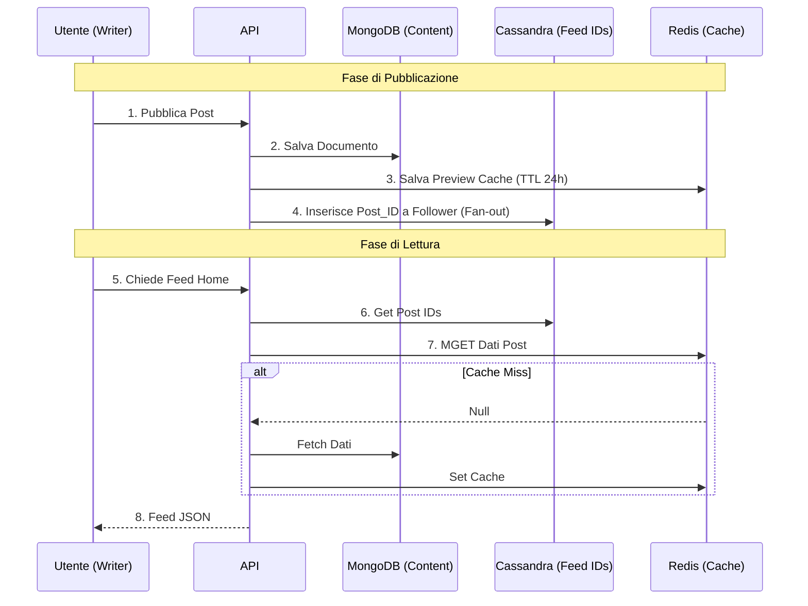
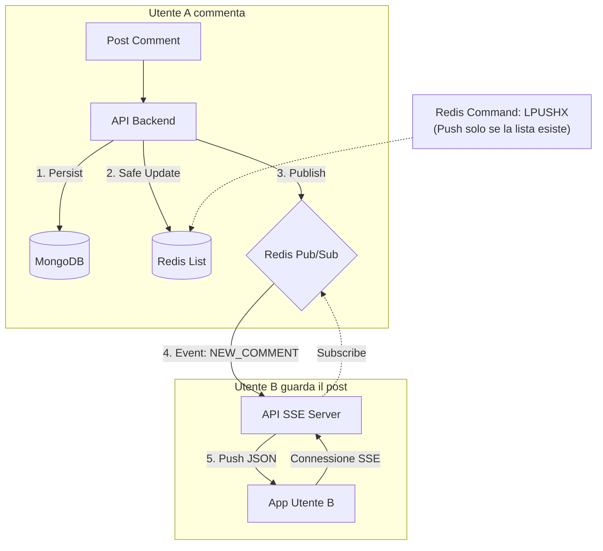
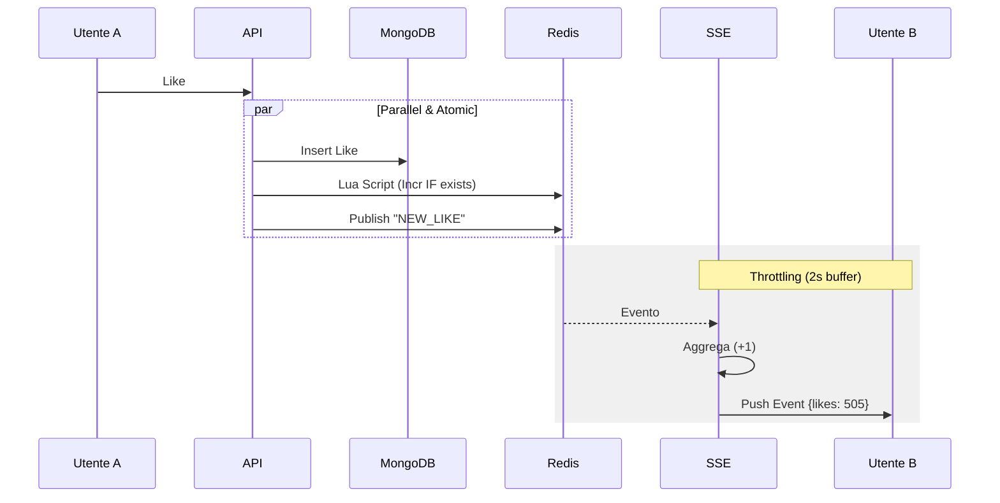

# 🏛 Architettura Vibely

## 🎯 Visione & Obiettivi
Vibely è una piattaforma a microservizi per community culturali.
**Obiettivo**: Creare un sistema scalabile, resiliente e manutenibile per gestire Identità, Contenuti e Interazioni Sociali.

> 📘 **Approfondimento Tecnico**: Per i dettagli sulle sfide superate (es. orchestrazione notifiche, fallback, migrazioni), vedi **[ARCHITECTURAL_CHALLENGES.md](architectural_challenges.md)**.

---

## 🏗 Stack Tecnologico (Hybrid Live)

Affinato per garantire persistenza, performance e real-time.

| Componente | Tecnologia | Ruolo |
| :--- | :--- | :--- |
| **Source of Truth** | MongoDB | Document Store principale (Post, Commenti). |
| **Timeline Store** | Cassandra | Time-series ordinata solo per gli ID del feed (Fan-out). |
| **Cache & Pub/Sub** | Redis | Caching preview, conteggi write-through e messaggistica SSE. |
| **Real-Time** | SSE + Huma | Push "Live" verso il client (es. nuovi commenti/like). |
| **Media** | MinIO (S3) | Object Storage per immagini/video. |

---

## 🏎 Strategia Caching & Performance

Ecco la tabella di riferimento per la gestione dei dati in Redis:

| Tipo Dato | Dove vive (Master) | Strategia Redis (Cache) | Comando Critico | TTL |
| --- | --- | --- | --- | --- |
| **Post Body** | MongoDB | **Read-Through** (Leggo se manca) | `GET` / `SET` | **24 Ore** |
| **Feed (Home)** | Cassandra | **Non cachato** (Già ottimizzato) | N/A | N/A |
| **Commenti** | MongoDB | **Write-Update** (Aggiorno se c'è) | `LPUSHX` | **4 Ore** |
| **Likes (Count)** | MongoDB | **Write-Update** (Incr. se c'è) | `EVAL` (Lua) | **24 Ore** |
| **Likes (Stream)** | N/A | **Pub/Sub** (Effimero) | `PUBLISH` | Real-time |

---

## 🔄 Workflow Principali

### 1. Feed Timeline (Fan-out on Write)
Obiettivo: Caricamento istantaneo della Home. L'ID viene propagato ai follower in scrittura.

### 2. Live Comments (Write-Through)
Obiettivo: Aggiornare la lista commenti in cache e notificare via SSE senza race conditions.

### 3. Live Likes (Throttling)
Obiettivo: Contatore "vivo" ma solido. Lua script per l'atomicità, Throttling per non saturare il client.

