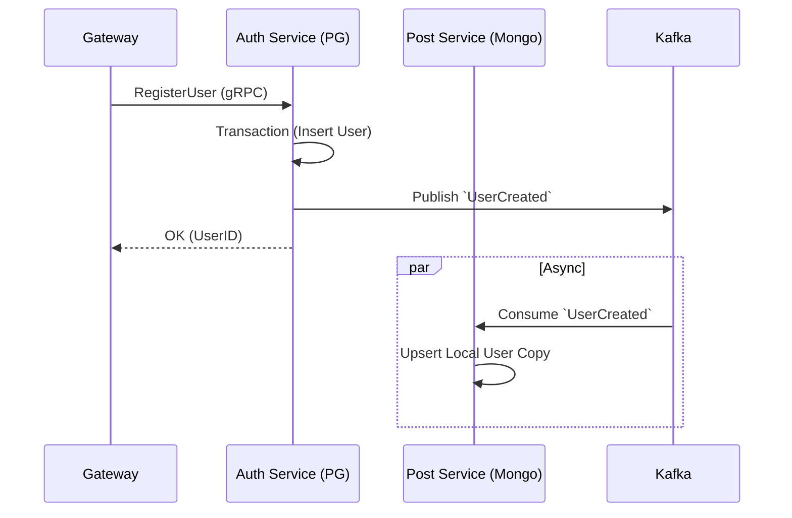
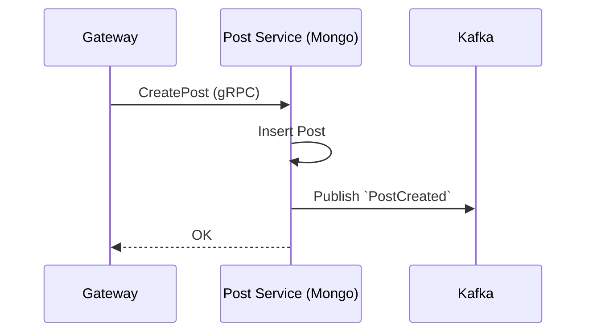

# 🏛 Architettura Vibely

## 🎯 Visione & Obiettivi
Vibely è una piattaforma a microservizi per community culturali.
**Obiettivo**: Creare un sistema scalabile, resiliente e manutenibile per gestire Identità, Contenuti e Interazioni Sociali.

---

## 🏗 Stack Tecnologico (Stato Attuale)

| Componente | Tecnologia | Ruolo |
| :--- | :--- | :--- |
| **Gateway** | Go + Huma | API Router, Auth Middleware, Validazione. |
| **Auth Service** | Go + Postgres + Redis | Gestione Utenti, JWT (Stateless access, Stateful refresh). |
| **Post Service** | Go + MongoDB | Gestione Post, Feed, Event Sourcing (sincronizzazione Utenti). |
| **Bus** | Kafka (Watermill) | Comunicazione Asincrona (Disaccoppiamento). |
| **Proto** | gRPC + Buf v2 | Contratti strict tra servizi. |

---

## 🧠 Principi Architetturali

### 1. Source of Truth (SoT)
Ogni servizio possiede i suoi dati.
- **Auth**: Postgres (ACID).
- **Post**: MongoDB (Document).
**Regola**: Nessuno scrive nel DB altrui. Si usa gRPC per le letture sincrone e Kafka per la replicazione dati (es. `UserCreated` -> salvataggio copia utente in `post-service`).

### 2. CQRS Lite & Event Driven
Separiamo le operazioni di scrittura da quelle di lettura/reazione.
- **Command**: `CreatePost` (gRPC) -> Scrive su Mongo.
- **Event**: `PostCreated` (Kafka) -> Notifica altri sistemi (es. notifiche, analytics).

### 3. Librerie Condivise (`shared/pkg`)
Per garantire consistenza e resilienza, utilizziamo wrapper standardizzati:
- `grpcutil`: Client/Server gRPC con interceptor pre-configurati (OTel, Logging, Circuit Breaker, Retry).
- `watermillutil`: Publisher/Subscriber Kafka con OTel tracing e middleware di resilienza.
- `resiliency`: Implementazioni standard di Circuit Breaker e Retry.
- `observability`: Configurazione centralizzata per Tracing (OpenTelemetry) e Logging (`slog`).

### 4. Sicurezza & Resilienza
- **Zero Trust**: Comunicazione interna via gRPC.
- **Circuit Breaker**: Protezione "fail-fast" per prevenire il cascading failure (es. Gateway -> Post Service).
- **Retry & Backoff**: Riprovi automatici con jitter per chiamate RPC e messaggistica.
- **Distroless**: Immagini Docker minimali.
- **Graceful Shutdown**: Gestione corretta dei segnali.

---

## 🔄 Workflow Principali

### User Onboarding

### Creazione Post

