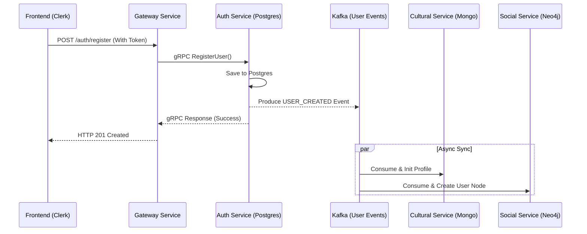
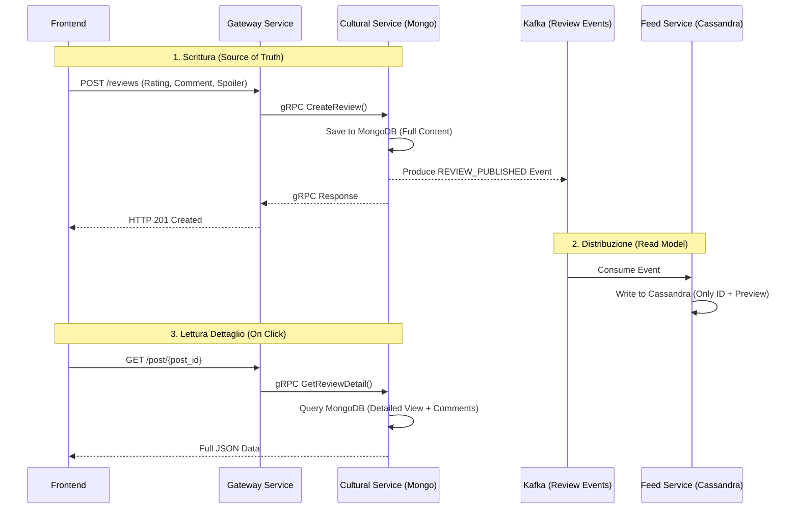
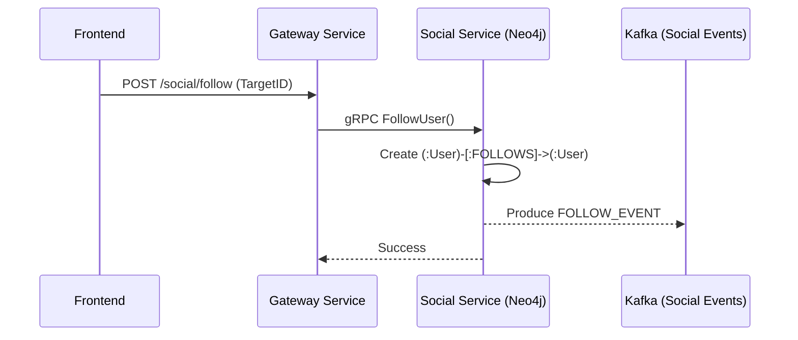
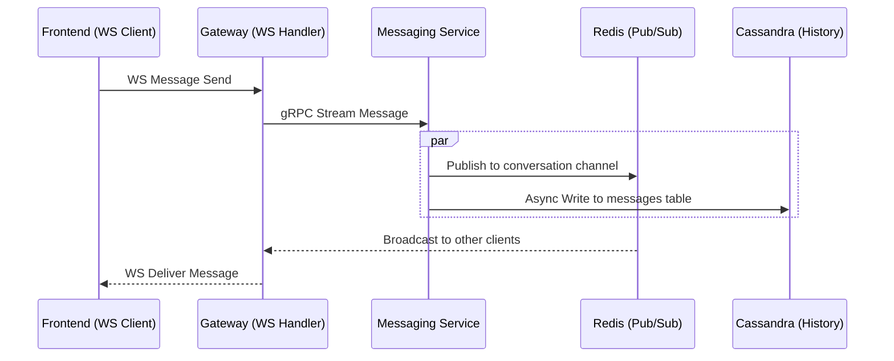

# 🔄 Workflow di Sistema & Distributed Tracing

In un'architettura a microservizi come quella di Vibely, comprendere come una richiesta attraversa i vari componenti è fondamentale per il debugging e l'ottimizzazione. Questo documento mappa i flussi principali e spiega come monitorarli tramite **Distributed Tracing**.

---

## 🛰️ Osservabilità con Jaeger & OpenTelemetry

Per visualizzare i workflow descritti di seguito, utilizziamo **OpenTelemetry (OTel)** per la strumentazione e **Jaeger** come backend di visualizzazione.

- **Span**: Ogni operazione (chiamata gRPC, query DB, pubblicazione su Kafka) crea uno "span".
- **Trace**: Una collezione di span correlati che rappresentano l'intero viaggio di una richiesta.
- **Context Propagation**: Il `trace_id` viene passato tra i servizi tramite header gRPC e metadati Kafka, permettendo a Jaeger di ricostruire l'intero flusso.

---

## 🧠 Filosofia Architetturale: I Pilastri di Vibely

Prima di analizzare i flussi, è fondamentale comprendere i concetti che guidano lo sviluppo di questa piattaforma.

### 1. Source of Truth (SoT)
In Vibely, ogni microservizio è il "proprietario" (Master of Record) di un specifico dominio di dati.
- **Auth Service**: Postgres è la SoT per l'identità e le credenziali.
- **Cultural Service**: MongoDB è la SoT per il contenuto delle opere e le recensioni.
- **Social Service**: Neo4j è la SoT per il grafo delle relazioni.

**Regola d'oro**: Nessun servizio scrive direttamente nel DB di un altro. La comunicazione avviene solo tramite gRPC (per leggere dati in tempo reale) o Kafka (per sincronizzare dati in modo asincrono).

### 2. Disaccoppiamento & Enablement (Kafka)
Kafka non è solo un "trasportatore di dati", ma uno strumento di **Enablement**.
- **Disaccoppiamento**: Se il `Social Service` emette un evento `FOLLOW_EVENT`, non sa chi lo userà. Questo permette di aggiungere nuovi servizi (es. un motore di notifiche o un sistema di analytics con Grafana) senza modificare una singola riga di codice del servizio originale.
- **Evoluzione**: Possiamo "iniettare" nuove funzionalità nel sistema semplicemente creando nuovi consumer.

### 3. Read Model vs. Write Model (Fan-out)
Molti servizi usano un database diverso da quello della SoT per ottimizzare la lettura. Questo è evidente nel workflow delle recensioni.

---

### 1. User Onboarding (Registrazione Utente)
Questo flusso gestisce la creazione dell'identità e la sincronizzazione iniziale dei dati sui database specializzati.

- **Tecnologie**: gRPC (Sync), Kafka (Async), Postgres (Transactional).
- **Jaeger View**: Vedrai uno span lungo per `RegisterUser` e degli span figli asincroni che partono dal consumer Kafka.

---

### 2. Pubblicazione Recensione (Fan-out & Data Enrichment)
Questo workflow dimostra come separiamo la scrittura dei dati (per la persistenza) dalla loro distribuzione (per le performance del feed).

- **Perché Cassandra?**: Cassandra gestisce la timeline. Quando un utente apre il feed, legge solo l'anteprima e l'ID da Cassandra (scalabile su milioni di follower).
- **Perché MongoDB?**: Quando l'utente clicca su "Leggi di più" o vuole vedere i commenti, interroghiamo la **Source of Truth** (Mongo) per recuperare l'intero oggetto JSON. Questo mantiene il feed leggero e veloce.

#### ⚡ Gestione dei Contatori (Like & Commenti)
I contatori sono dati altamente dinamici. Ecco come vengono gestiti per non sacrificare le performance:
1. **L'azione**: L'utente mette "Like". Il `Cultural Service` riceve la richiesta e aggiorna il totale su MongoDB (**Source of Truth**).
2. **L'evento**: Viene emesso un evento `LIKE_ADDED` su Kafka.
3. **L'aggiornamento Cassandra**: Il `Feed Service` ascolta l'evento e incrementa il contatore nella riga corrispondente su Cassandra. 
   - *Nota*: Cassandra supporta i tipi `counter`, ideali per queste operazioni atomiche senza dover leggere il file prima di scrivere.
4. **Ottimizzazione (Caching)**: Per post virali, i contatori possono essere letti da **Redis** in tempo reale per evitare troppe query a Cassandra, sincronizzando poi i dati periodicamente.

---

### 3. Social Interaction (Follow User)
Aggiornamento del grafo sociale per suggerimenti futuri.

- **Tecnologie**: Neo4j (Graph), Cypher Query Language.
- **Tracing Focus**: Monitoraggio delle performance delle query Cypher all'interno dello span del `Social Service`.

---

### 4. Real-time Messaging (Chat)
Flusso a bassa latenza che combina WebSocket e persistenza.

- **Tecnologie**: WebSockets, Redis Pub/Sub, Cassandra (Storage).
- **Latenza**: Tracciamento della latenza end-to-end dal momento in cui il messaggio tocca il Gateway a quando viene consegnato.

---

## 🛠️ Come Analizzare una Traccia

Se un'operazione è lenta (es. la creazione del profilo sembra metterci troppo):
1. Apri **Jaeger UI**.
2. Cerca per `Service: gateway-service` e `Operation: RegisterUser`.
3. Ispeziona la timeline:
   - Se il blocco più lungo è in `auth-service`, controlla le query Postgres.
   - Se c'è un gap temporale tra la produzione e il consumo del messaggio Kafka, controlla il lag dei consumer.

Questo approccio ci permette di passare da "il sistema è lento" a "la query X sul DB Y sta impiegando 500ms".
