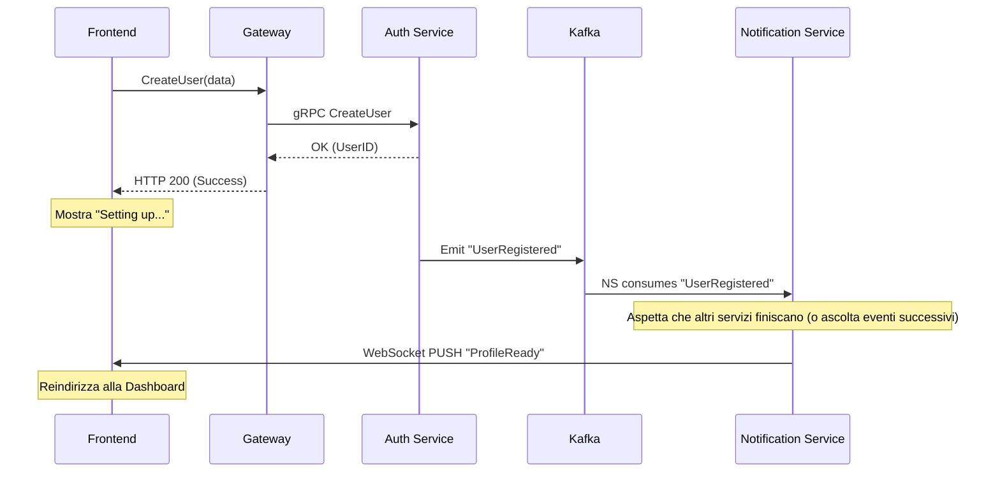

# Workflow Frontend: Gestione Eventi Asincroni

In un'architettura a microservizi come Vibely, molte operazioni lunghe o che coinvolgono più database vengono gestite in modo asincrono. Questa guida spiega come il frontend gestisce la transizione tra operazioni sincrone (gRPC) e asincrone (Kafka/Event-Driven).

---

## 🔄 Il Ciclo di Vita della Registrazione

Prendiamo come esempio la creazione di un account:

### 1. La Fase Sincrona (gRPC)
L'utente clicca su "Registrati". 
- **Frontend**: Invia una richiesta `CreateUser` al Gateway.
- **Backend (Auth Service)**: 
    - Valida i dati.
    - Scrive su **Postgres** (Master della Verità).
    - Risponde con `200 OK` e l'ID utente.
- **Frontend**: Riceve la risposta e mostra una notifica: *"Account creato! Stiamo preparando il tuo profilo culturale..."*.

### 2. La Fase Asincrona (Kafka)
In background, l' `auth-service` pubblica l'evento `UserRegistered`.
- **Microservices**: `mongo-service` crea la scheda profilo; `cassandra-service` inizializza il feed.
- **Incognita**: Queste operazioni potrebbero metterci 50ms come 5 secondi (se il sistema è sotto carico).

---

## 🔔 Strategie di Notifica al Frontend

Come facciamo a sapere quando i "Data Services" hanno finito?

### Strategia A: WebSockets (Reale-Time Push)
È l'approccio consigliato per Vibely. Utilizziamo un server WebSocket (es. Centrifugo o un microservizio `notification-service`).



**Cosa succede se fallisce?**
Se la creazione del profilo su Mongo fallisce (evento `ProfileCreationFailed`), il `Notification Service` invia un push di errore. Il frontend mostrerà un messaggio: *"Ops! Qualcosa è andato storto nel setup. Riprova a completare il profilo nelle impostazioni"*.

---

### Strategia B: Smart Polling (Pull)
Se i WebSocket non sono disponibili o per fallback.

1. **Stato Locale**: Il frontend salva l'ID utente e uno stato `status: "pending"`.
2. **Polling**: Ogni 2-3 secondi interroga `GET /users/{id}/status`.
3. **Risoluzione**: Quando il server risponde con `ready: true`, il frontend sblocca la UI.

---

## 🎨 User Experience (UX) e Gestione Errori

### 1. Optimistic UI
Per azioni minori (es. mettere "Segui" a un autore), il frontend aggiorna subito l'interfaccia. Se dopo 2 secondi arriva un evento di fallimento via WebSocket, il bottone torna "Segui" con una piccola notifica di errore (Rollback Visivo).

### 2. Stati di Caricamento Intelligenti
Non usare un semplice spinner infinito. Usa **Skeleton Screens** o messaggi informativi:
- *"Stiamo importando i tuoi libri preferiti..."*
- *"Generando la tua mappa degli interessi..."*

### 3. Fallimenti Critici
Se l'operazione asincrona fallisce definitivamente (es. Kafka perde il messaggio, eventualità rara):
- **Timeout Frontend**: Se dopo 30 secondi non arriva nulla, il frontend suggerisce di ricaricare la pagina o contattare il supporto.
- **Controllo al Login**: Ogni volta che l'utente logga, il backend controlla se il setup è completo. Se mancano i dati su Mongo, ri-emette l'evento.

---

## 🛠️ Esempio Codice (Pseudo-JS)

```javascript
async function handleRegistration(userData) {
    try {
        // 1. Chiamata sincrona
        const response = await api.createUser(userData);
        showToast("Account creato! Preparazione in corso...");

        // 2. Ascolto WebSocket
        socket.subscribe(`user_events_${response.userId}`, (event) => {
            if (event.type === 'PROFILE_READY') {
                router.push('/dashboard');
            } else if (event.type === 'SETUP_ERROR') {
                showError("Errore nel setup del profilo.");
            }
        });

    } catch (err) {
        showError("Email già utilizzata o errore server.");
    }
}
```
