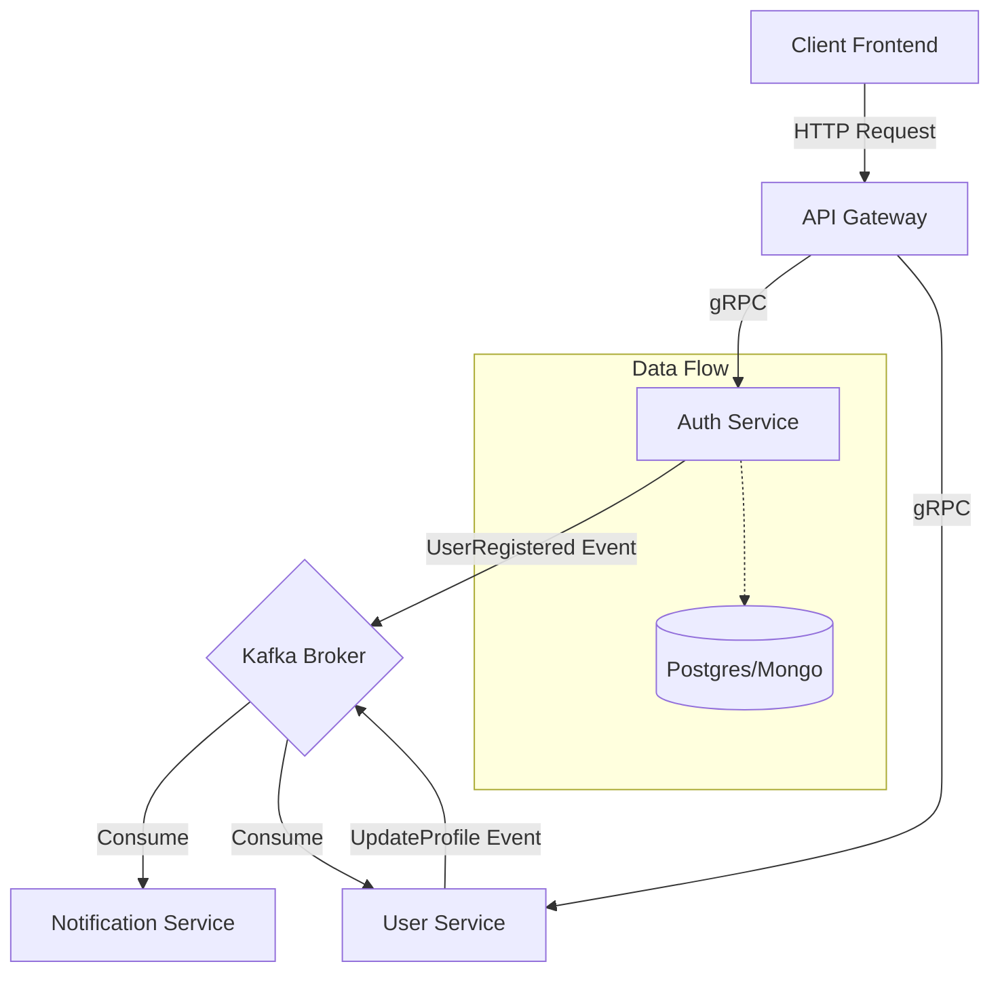
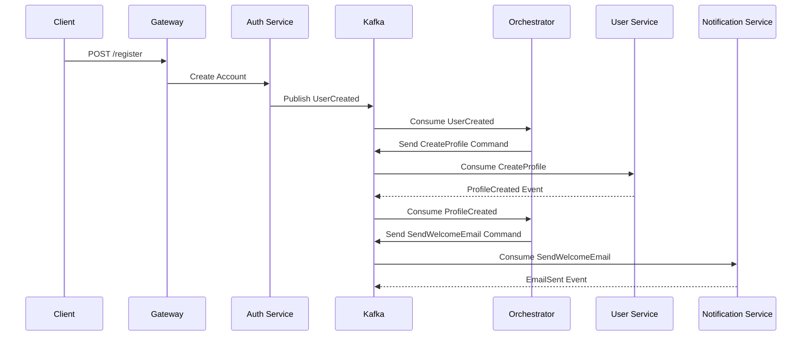

# Architettura del Sistema

L'architettura è basata su microservizi che collaborano per fornire le funzionalità di business.

## Scalabilità

Ogni microservizio è stateless e può essere scalato orizzontalmente. L'uso di Kafka permette di gestire picchi di traffico ammortizzando il carico tramite code di messaggi.

## Gestione Sincrona vs Asincrona

### Sincrono (gRPC/HTTP)

Utilizzato per operazioni che richiedono risposta immediata (es. login, lettura dati profilo).

- **Vantaggi**: Bassa latenza, semplicità.
- **Svantaggi**: Accoppiamento temporale.

### Asincrono (Event-Driven)

Utilizzato per operazioni complesse, notifiche, e propagazione dati (es. registrazione utente, invio email).

- **Vantaggi**: Disaccoppiamento, resilienza, scalabilità.
- **Pattern**: Saga Orchestration.

## Data Flow Diagram

### Saga Pattern Flow

Esempio di flusso di registrazione utente (Saga):

