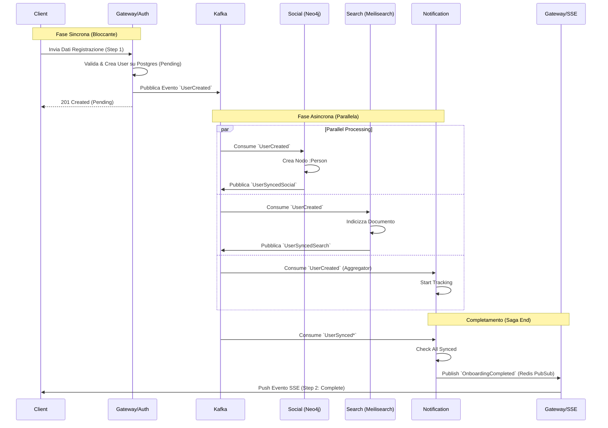
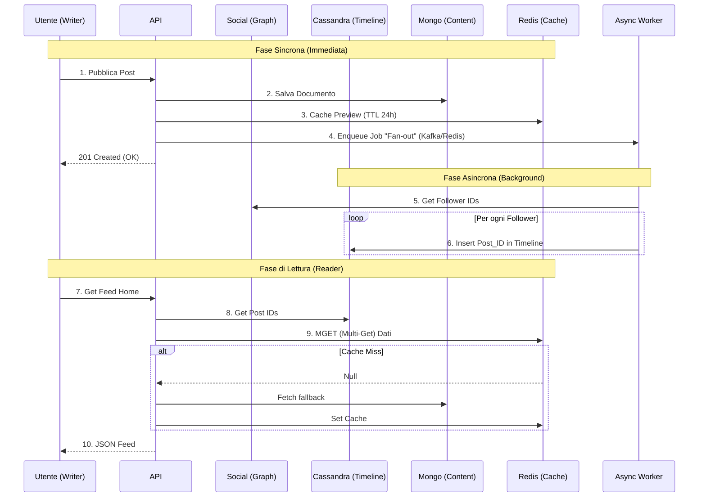
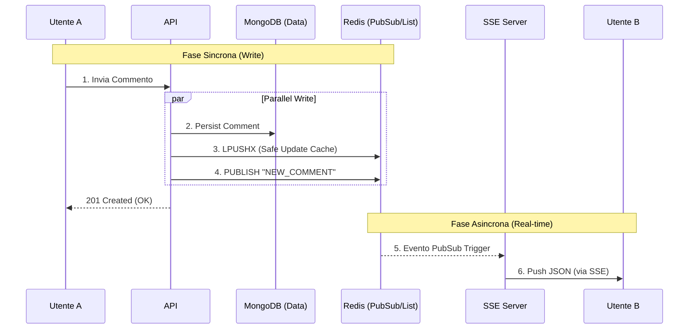
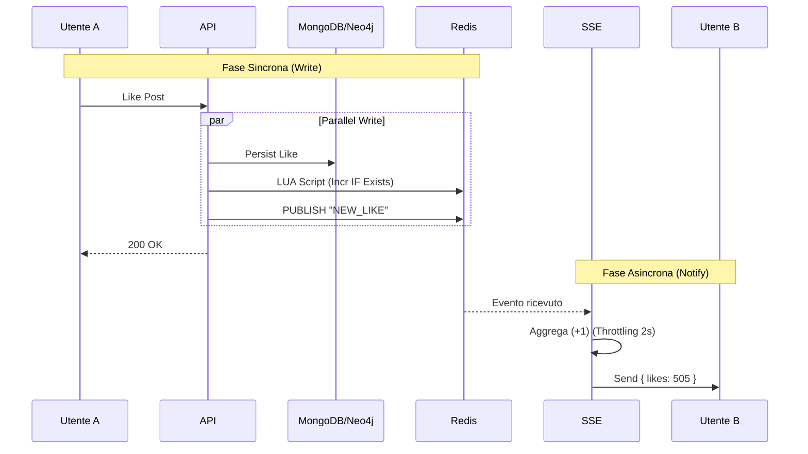

# 🔄 Data Flows & Operazioni

In Vibely, le operazioni sono divise in due categorie principali: **Sincrone** (User-facing, immediate) e **Asincrone** (System-facing, eventual consistency).

---

## 1. Registrazione Utente (Pattern Saga)

La registrazione è un processo distribuito che garantisce la coerenza tra i vari microservizi (SQL, Graph, Search).

**Trigger**: `POST /auth/register`

### Gestione Errori (Non implementata in MVP)

Se uno dei consumer fallisce e esaurisce i retry, si attiva una **Compensating Transaction** (es. `UserCreationFailed`) che notifica l'Auth Service per cancellare l'utente o si notifica l'utente dell'errore.

---

## 2. Gestione del Feed (La Timeline - Fan-out)

**Obiettivo:** Caricamento istantaneo della Home.
**Approccio:** Fan-out on Write (Pre-calcolo).

- **Fase Sincrona (Bloccante):** Salvataggio contenuto su MongoDB e Cache Preview.
- **Fase Asincrona (Non Bloccante):** Propagazione ID ai follower (Fan-out).

---

## 3. Gestione "Live" dei Commenti

**Obiettivo:** Nuovi commenti in real-time senza invalidare la cache.
**Tecnica:** Write-Through `LPUSHX` + SSE.

- **Fase Sincrona:** Persistenza su DB e aggiornamento cache Redis.
- **Fase Asincrona (Real-time):** Invio notifica via SSE ai client connessi.

---

## 4. Gestione "Live" dei Mi Piace (Contatori)

**Obiettivo:** Aggiornamento veloce, evitare "reset a 1", throttling.
**Tecnica:** Redis Lua Script (`INCR_IF_EXISTS`) + SSE Throttling.

- **Fase Sincrona:** Aggiornamento contatore Redis (veloce) e Persistenza DB.
- **Fase Asincrona:** Throttling e invio evento aggregato via SSE.

---

## 5. Riepilogo Strategia Caching

| Tipo Dato     | Master DB   | Strategia Cache (Redis)           | Comando     | TTL |
| :------------ | :---------- | :-------------------------------- | :---------- | :-- |
| **Post Body** | MongoDB     | **Read-Through** (Leggo se manca) | `GET`/`SET` | 24h |
| **Feed**      | Cassandra   | **No Cache** (Già ottimizzato)    | -           | -   |
| **Commenti**  | MongoDB     | **Write-Update** (`LPUSHX`)       | `LPUSHX`    | 4h  |
| **Likes**     | Mongo/Neo4j | **Write-Update** (Lua Incr)       | `EVAL`      | 24h |
