# 🔄 Data Flows & Operazioni

In Vibely, le operazioni sono divise in due categorie principali: **Sincrone** (User-facing, immediate) e **Asincrone** (System-facing, eventual consistency).

---

## 1. Registrazione Utente (Pattern Saga)

La registrazione è un processo distribuito che garantisce la coerenza tra i vari microservizi (SQL, Graph, Search).

**Trigger**: `POST /auth/register`

### Gestione Errori (Non implementata in MVP)

Se uno dei consumer fallisce, si attiva una **Compensating Transaction** (es. `UserCreationFailed`) per cancellare l'utente o marchiarlo come "incompleto".

---

## 2. Pubblicazione Post (Fan-out on Write)

Per garantire una lettura veloce della Home Feed, il costo computazionale viene spostato in fase di scrittura.

**Trigger**: `POST /posts`

```mermaid
sequenceDiagram
    participant User as Utente A
    participant Post as Post Service
    participant Kafka
    participant Msg as Messaging/Feed
    participant Followers as Follower B, C..

    User->>Post: Crea Post
    Post->>Post: Salva su MongoDB
    Post->>Kafka: Pubblica `PostCreated`

    Kafka->>Msg: Consume `PostCreated`
    Msg->>Msg: Recupera Follower ID di A (da Neo4j/Cache)

    loop Per ogni Follower
        Msg->>Msg: Inserisce PostID in Timeline (Cassandra)
    end

    Note right of Msg: Ora il feed dei follower è aggiornato
```

---

## 3. Messaggistica Real-Time

Flusso ibrido Persistenza + Push Notification.

**Trigger**: Utente A invia messaggio a Utente B.

