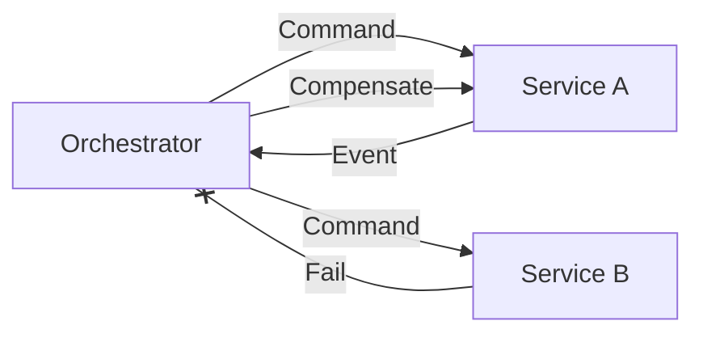

# Principi di Design & Case Study

Le scelte architetturali di questo progetto sono guidate da principi teorici solidi (Microservices, Polyglot Persistence) e ispirate a case study industriali (Uber, Netflix).

## 1. Evoluzione Architetturale: Dai Monoliti ai Microservizi

Come illustrato nelle slide di riferimento (_01-Microservizi_), l'adozione dei microservizi risponde ai limiti di scalabilità e manutenibilità delle architetture monolitiche.

- **Decomposizione**: Ogni servizio ha una responsabilità unica (Single Responsibility Principle) e un proprio ciclo di vita.
- **Indipendenza**: I servizi (Auth, Social, Post) sono deployati indipendentemente, permettendo aggiornamenti senza downtime dell'intero sistema.
- **Scalabilità**: Possiamo scalare solo i servizi sotto carico (es. Notification Service durante un picco) senza sprecare risorse sugli altri.

## 2. Polyglot Persistence & CAP Theorem

Seguendo l'architettura di riferimento (_05-BasiDati-NoSQL_), utilizziamo diversi database per risolvere problemi diversi, accettando i trade-off del **Teorema CAP** (Consistency, Availability, Partition Tolerance).

### La Scelta dei Database (Basato su Slide 02-04)

- **MongoDB (CP/AP a seconda config)**: Scelto per la sua flessibilità di schema (Document Model) e BSON, ideale per entità che evolvono rapidamente come i Post.
- **Neo4j (CA/CP)**: Essenziale per gestire relazioni complesse (Property Graph Model) che in un RDBMS richiederebbero join costose e lente. Garantisce ACID completezza per le operazioni sul grafo sociale.
- **Cassandra (AP)**: Un database Colonnare P2P (tutti i nodi sono pari) ottimizzato per scritture massive e disponibilità, perfetto per la timeline utenti e messaggistica.

## 3. gRPC & Performance (Ispirato a Uber)

**Contesto**: Uber è passata da JSON/HTTP a gRPC per la comunicazione tra microservizi per ridurre la latenza e migliorare l'affidabilità.
[Riferimento: Uber’s Next-Gen Push Platform](https://www.uber.com/en-IT/blog/ubers-next-gen-push-platform-on-grpc/)

### La Nostra Implementazione

Utilizziamo **gRPC** (su HTTP/2) per comunicazioni **Inter-Service** sincrone.

- payload binari (Protobuf) più efficienti del JSON.
- Contratti `.proto` stretti.

## 4. API Gateway & Resiliency (Ispirato a Netflix)

**Contesto**: Netflix utilizza un API Gateway (Zuul) per routing e resilienza.

### La Nostra Implementazione

Il **Gateway Service**:

- **Routing**: Entry point unico.
- **Auth Offloading**: Verifica JWT.
- **Pattern Resilienza**: Circuit Breaking per evitare cascading failures.

## 5. Scalabilità Real-Time (Ispirato a Discord/Uber)

**Contesto**: Gestione di milioni di connessioni persistenti.

### La Nostra Implementazione

Il **Notification Service** gestisce stream (SSE/gRPC) per aggiornamenti real-time, mantenendo lo stato delle connessioni in modo efficiente e scalabile.

## 6. Saga Pattern (Distributed Transactions)

**Problema**: Assenza di transazioni ACID distribuite.

### Implementazione: Orchestration

Adottiamo **Saga Orchestration** per la consistenza eventuale.

1. **Orchestrator**: Coordina la sequenza di eventi.
2. **Compensazione**: Esegue azioni di undo in caso di fallimento.
3. **Dead Letter Queue**: Gestione messaggi corrotti senza bloccare il sistema.

